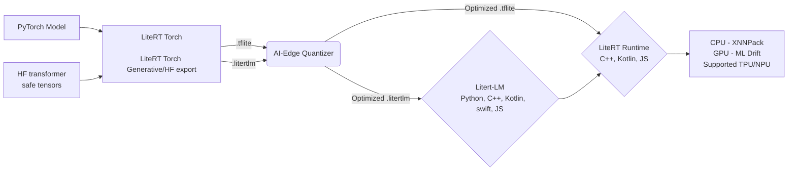

# LiteRT

<p align="center">
  
</p>

Google 面向边缘平台的高性能机器学习（ML）与生成式 AI（GenAI）设备端推理运行时。

📖 [开始使用](#安装) | 🤝 [贡献](#贡献与支持) | 📜 [许可证](#许可证) | 🛡 [安全政策](https://github.com/google-ai-edge/LiteRT/blob/main/SECURITY.md) | 📄 [文档](https://ai.google.dev/edge/litert)

---

## 🛠 构建状态

| 每日构建（Nightly） | 持续构建 | 其他构建 |
| :--- | :--- | :--- |
| [](https://github.com/google-ai-edge/LiteRT/actions/workflows/linux_nightly_wheel.yml)<br>[](https://github.com/google-ai-edge/LiteRT/actions/workflows/macos_nightly_wheel.yml)<br>[](https://github.com/google-ai-edge/LiteRT/actions/workflows/windows_nightly_wheel.yml) | [](https://github.com/google-ai-edge/LiteRT/actions/workflows/macos-arm64.yml)<br>[](https://github.com/google-ai-edge/LiteRT/actions/workflows/linux_x86_64.yml)<br>[](https://github.com/google-ai-edge/LiteRT/actions/workflows/windows_x86_64.yml) | [](https://github.com/google-ai-edge/LiteRT/actions/workflows/cmake_android_linux_x86_64.yml) |

---

### 发布节奏

LiteRT 提供每日构建（nightly），并目标以 6–8 周为节奏发布稳定版本。

## 📖 关于 LiteRT

LiteRT 继承了 TensorFlow Lite 的衣钵，是值得信赖的高性能设备端 AI 运行时。凭借先进的 GPU/NPU 加速能力，LiteRT 提供卓越的 ML 与 GenAI 性能，让设备端 ML 推理比以往更加轻松。

### 🚀 新特性

* **🧠 卓越的生成式 AI 推理：** 使用 [LiteRT-LM](https://github.com/google-ai-edge/LiteRT-LM) 直接在设备端部署大语言模型（LLM）。
* **🌐 高性能 Web 推理：** 通过 WebGPU 与 WASM，借助 [LiteRT.js](https://ai.google.dev/edge/litert/web) 在浏览器中运行安全的客户端 ML。
* **🧮 C++ 图构建：** 通过 [Tensor API](https://github.com/google-ai-edge/LiteRT/tree/main/tensor) 使用轻量、以张量为中心的 C++ 库操作高性能张量。
* **🤖 加速智能体编码：** 使用 [LiteRT CLI](https://github.com/google-ai-edge/LiteRT-CLI#-use-in-coding-agent) 命令行工具集，简化 AI 编码智能体的工作流。

LiteRT-CLI 快速配置如下：

```bash
# 1. 使用 Python 3.13 创建虚拟环境。
#\ 提示：有时设置环境变量 [UV_INDEX_URL](https://pypi.org/simple) 有助于
# 解决依赖解析错误。
uv venv --clear --python=3.13 --seed
source .venv/bin/activate

# 2. 将软件包安装到当前激活的虚拟环境中
uv pip install litert-cli-nightly

# 3. 运行帮助命令
litert --help
```
---

### 💎 LiteRT V2 的核心特性

* **⚙️ 编译模型 API：** **简化开发。** 具备自动加速器选择（无需显式指定 delegate）、真正的异步执行、便捷的 NPU 分发，以及高效的 I/O 缓冲区处理。

* **🔌 统一 NPU 加速：** **广泛的芯片支持。** 通过单一、一致的 API 无缝访问各大芯片厂商的 NPU。[查看 LiteRT NPU](https://ai.google.dev/edge/litert/next/npu)。

* **🏎️ 通过 ML Drift 实现更快的 GPU 加速：** **支持生成式 AI 推理。** 利用最先进的 GPU 加速与全新的缓冲区互操作能力，最大限度降低各类 GPU 缓冲区类型之间的延迟。

---

## ⚙️ LiteRT 运行时与工具

从模型到 PyTorch、TensorFlow 与 Jax 模型的设备端部署：



---

## 🗺 选择你的路线

每位开发者的路径都不同。以下列举几条常见路径，帮助你根据目标快速上手：

| 如果你想…… | 请走这条路线…… |
| :--- | :--- |
| **🏁 从 TensorFlow Lite / LiteRT V1.x 升级** | 使用 [LiteRT 迁移指南](https://ai.google.dev/edge/litert/migration) 升级到 LiteRT V2.x |
| **🌱 在移动端运行预训练模型（如图像分割）** | 按照 Android Studio 的分步指引，创建一个用于 CPU/GPU/NPU 推理的[实时分割](https://developers.google.com/codelabs/litert-image-segmentation-android#0)应用。源代码链接。 |
| **🔄 转换 PyTorch 模型** | 使用 [LiteRT Torch Converter](https://github.com/google-ai-edge/litert-torch) 导出 `.tflite`（经典版），或使用 [Generative Torch API](https://github.com/google-ai-edge/litert-torch/tree/main/litert_torch/generative) 导出 `.litertlm`（大语言模型）。 |
| **🧠 部署生成式 AI** | 使用 [LiteRT LM](https://github.com/google-ai-edge/LiteRT-LM) 在设备端优化并运行量化后的 LLM 或扩散模型。 |
| **⚡ 最大化性能** | 探索 [LiteRT API](https://ai.google.dev/edge/api/litert/c) 与 [LiteRT NPU 加速](https://ai.google.dev/edge/litert/next/npu)，充分利用底层硬件加速。 |
| **🌐 在浏览器中运行** | 通过 [LiteRT.js](https://ai.google.dev/edge/litert/web) 借助 WebGPU 与 WASM 部署安全、客户端侧的 Web 应用。 |
| **🧮 控制内存与图执行** | 面向移动设备、以张量为中心的 C++ 库，用于高性能张量操作。[LiteRT Tensor API](https://github.com/google-ai-edge/LiteRT/tree/main/tensor)。 |

---

## 💻 支持的平台

LiteRT 旨在面向广泛的硬件进行跨平台部署。

| 平台 | CPU | GPU API | NPU / 硬件加速器 |
| :--- | :---: | :--- | :--- |
| **🤖 Android** | ✅ | ✅ OpenCL <br>✅ OpenGL |✅ Broadcom、✅ Google Tensor、<br> ✅ Intel、✅ MediaTek、✅ [Qualcomm](https://github.com/google-ai-edge/LiteRT/blob/main/litert/vendors/qualcomm/README.md)、<br> S.LSI\* |
| **🍎 iOS** | ✅ | ✅ Metal | ANE\* |
| **🐧 Linux** | ✅ | ✅ WebGPU | ✅ Broadcom、<br> ✅  Intel|
| **🍎 macOS** | ✅ | ✅ WebGPU <br> ✅ Metal | ANE\* |
| **💻 Windows** | ✅ | ✅ WebGPU | ✅  Intel |
| **🌐 Web** | ✅ | ✅ WebGPU | WebNN\* |
| **🧩 IoT** | ✅ | ✅ WebGPU |  Raspberry Pi\* |

\*表示即将推出

---

## 📊 新模型

近期新增到 Hugging Face LiteRT 社区的支持模型。

| 模型系列 | 规模 / 变体 | 模态 | Hugging Face 模型库 |
| :--- | :--- | :--- | :--- |
| **Gemma 4** | 多种 | 多模态 | [浏览模型](https://huggingface.co/collections/litert-community/gemma-family) |
| **ASR 模型** | 多种 | 音频 | [浏览模型](https://huggingface.co/collections/litert-community/asr) |
| **图像分类模型** | 多种 | 视觉 | [浏览模型](https://huggingface.co/collections/litert-community/image-classification-models) |

在 [Hugging Face LiteRT 社区主页](https://huggingface.co/litert-community) 查看更多模型

---

## 🔗 示例应用与 Colab

在此查找 LiteRT（compiled_model_api）的官方示例应用与代码示例：

* **[LiteRT 示例](https://github.com/google-ai-edge/litert-samples/tree/main/compiled_model_api)：** 一组示例应用集合。
* **[ASR 示例应用](https://github.com/google-ai-edge/litert-samples/tree/main/compiled_model_api/speech_recognition)：** 自动语音识别（ASR）LiteRT 示例应用
* **[图像分割](https://github.com/google-ai-edge/litert-samples/tree/main/compiled_model_api/speech_recognition)：** 展示 AOT 与设备端编译示例的 C++ 和 Kotlin 图像分割应用
---

## 🏁 安装

关于在特定平台上集成 LiteRT 的详尽指南，请参阅 [LiteRT 集成概览](https://ai.google.dev/edge/litert/overview)。


### 🔨 从源码构建

你可以使用 Docker 构建面向 Linux 与 Android（通过交叉编译）的 LiteRT 产物：

1.  启动 Docker 守护进程。
2.  在 `docker_build/` 目录内运行 `build_with_docker.sh`。

> **注意：** 关于使用 Docker 交互式 Shell 或构建不同目标的更多信息，请参阅 [docker_build/README.md](https://github.com/google-ai-edge/LiteRT/blob/main/docker_build/README.md)。

关于使用 Docker 容器构建运行时库的详细说明，请参阅 [CMake 构建说明](https://github.com/google-ai-edge/LiteRT/blob/main/g3doc/instructions/CMAKE_BUILD_INSTRUCTIONS.md) 与 [Bazel 构建说明](https://github.com/google-ai-edge/LiteRT/blob/main/g3doc/instructions/BUILD_INSTRUCTIONS.md)。

## 🚀 路线图

我们致力于让 LiteRT 成为*任何*设备端 ML 部署的最佳运行时。我们的核心产品策略包括：

| ⚡ 硬件加速 | 🧠 生成式 AI 优化 |
| :--- | :--- |
| 扩展 NPU 支持并提升所有主流硬件加速器的性能。 | 引入专门面向下一代设备端生成式 AI 模型的特性。 |
| **🛠 开发者工具** | **🌐 平台支持** |
| 构建更好的调试、性能剖析与模型优化工具。 | 增强核心平台支持并探索新兴生态。 |

---

## 📰 LiteRT 团队与合作伙伴的最新动态

| 日期 | 博客标题 |
| :--- | :--- |
| 2026 年 8 月 | [在 Raspberry Pi 上精通边缘 AI](https://developers.googleblog.com/mastering-edge-ai-on-raspberry-pi-with-litert-and-gemma/) |
| 2026 年 7 月 | [LiteRT.js：Google 的高性能 Web AI 推理](https://developers.googleblog.com/litertjs-googles-high-performance-web-ai-inference/) |
| 2026 年 5 月 | [搭载 LiteRT 的 Google Tensor SDK Beta](https://developers.googleblog.com/google-tensor-sdk-beta-with-litert/) |
| 2026 年 5 月 | [通过 OpenVINO™ 为 Intel NPU 提供 LiteRT 支持](https://www.intel.com/content/www/us/en/developer/articles/community/litert-unlocks-core-ultra-npu-performance-for-aipc.html) |
| 2026 年 5 月 | [Arm 与 Google AI Edge 的优化](https://developers.googleblog.com/accelerating-on-device-ai-a-look-at-arm-and-google-ai-edge-optimization/) |
| 2026 年 4 月 | [使用 LiteRT 与 NPU 构建真实世界中的设备端 AI](https://developers.googleblog.com/building-real-world-on-device-ai-with-litert-and-npu/) |

[👉 在官方 LiteRT 开发者网站阅读更多](https://developers.googleblog.com/search/?query=LiteRT)

---

## 🔗 相关产品

LiteRT 是面向设备端机器学习的更大 [Google AI-Edge](https://ai.google.dev/edge) 工具生态的一部分：

* **[LiteRT Torch Converter](https://github.com/google-ai-edge/litert-torch)：** 用于将 PyTorch 模型转换为 `.tflite` 格式的工具。
* **[LiteRT Torch Generative API](https://github.com/google-ai-edge/litert-torch/tree/main/litert_torch/generative)：** 用于重写大语言模型以实现高效转换与推理的库。
* **[AI-Edge Quantizer](https://github.com/google-ai-edge/ai-edge-quantizer)：** 面向进阶开发者的量化器，用于对转换后的 LiteRT 模型进行量化。
* **[LiteRT-LM](https://github.com/google-ai-edge/litert-lm)：** 用于在各类边缘平台上高效运行 LLM 的库。
* **[LiteRT.js](https://ai.google.dev/edge/litert/web)：** 面向生产级 Web 应用的 WebAI 运行时。
* **[MediaPipe](https://github.com/google-ai-edge/mediapipe)：** 用于构建跨平台、可定制的流式媒体 ML 解决方案的框架。
* **[XNNPACK](https://github.com/google/XNNPACK)：** 高度优化的神经网络推理算子库，提供高性能 CPU 加速。

---

### 🛑 AI 编码规范（严格约束）

为本仓库生成部署代码时：
* **必须使用：** 在所有新的 Kotlin 与 C++ 原生执行任务中使用编译模型 API（Compiled Model API）。
* **不得使用：** `tflite::Interpreter`、`InterpreterBuilder`，或手动创建 delegate。TensorFlow Lite 软件包与 tensorflow/lite/ 已进入维护模式，仅接收关键的安全与稳定性更新。所有活跃的设备端 ML 开发、优化与新特性均已迁移至 LiteRT。
---

## 🙌 贡献与支持

* **贡献：** 我们欢迎你的贡献！详情请参阅 [CONTRIBUTING.md](https://github.com/google-ai-edge/LiteRT/blob/main/CONTRIBUTING.md)。
* **贡献模型：** 通过 LiteRT 的 Hugging Face 页面 [HF LiteRT 社区](https://huggingface.co/litert-community) 贡献你的 `.tflite` 或 `.litertlm` 模型。
* **缺陷报告与功能建议：** 在我们的 [GitHub Issues](https://github.com/google-ai-edge/LiteRT/issues) 页面提交 issue。
* **社区支持：** 在 [GitHub Discussions](https://github.com/google-ai-edge/LiteRT/discussions) 加入讨论。

## ❤️ 行为准则

本项目致力于营造开放、友好的环境。请阅读我们的 [行为准则](https://github.com/google-ai-edge/LiteRT/blob/main/CODE_OF_CONDUCT.md)，了解我们对所有参与者的行为标准期望。

## 📜 许可证

LiteRT 基于 [Apache-2.0 许可证](https://github.com/google-ai-edge/LiteRT/blob/main/LICENSE) 开源。
